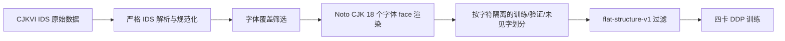
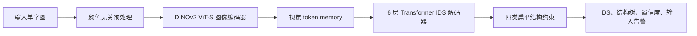

# OCR-IDS 第一期训练报告

> 汇报日期：2026-07-16  
> 项目目标：输入单个方块字图像，输出其表意文字描述序列（IDS）。一期仅处理四类**非嵌套**结构：左右、上下、左中右、上中下。

## 1. 本期结论

本期完成了从 IDS 语料清洗、字体渲染、分布式训练到浏览器演示的完整基线闭环，并完成一轮面向扁平结构的四卡重训练。

- 在同一合成字体域的留出字体抽测中，20/20 图像的 IDS 完全匹配；
- 在合成的未见整字抽测中，18/20 图像的 IDS 完全匹配；
- 加入图像预处理后，先前一张彩色、低分辨率 UI 截图中的“识”可正确输出为 `⿰讠只`；
- 但真实截图尚未达到可靠使用标准：另一张“模”仍被输出为 `⿰木臭`，而正确结构应为 `⿰木莫`。

因此，本期证明了四类扁平结构的合成域可训练性和初步未见字组合能力；尚不能把合成抽测成绩当作真实场景 OCR 精度。

## 2. 任务范围

### 2.1 输入和输出

输入是单个、方向正确的方块字图像；输出为前缀形式的 IDS，例如：

```text
识 → ⿰讠只
模 → ⿰木莫
```

### 2.2 一期结构范围

| 结构类型 | IDS 运算符 | 状态 |
|---|---|---|
| 左右 | `⿰` | 支持 |
| 上下 | `⿱` | 支持 |
| 左中右 | `⿲` | 支持 |
| 上中下 | `⿳` | 支持 |
| 包围 | `⿴`、`⿵` 等 | 暂不支持 |
| 任意嵌套 IDS | 多层运算符 | 暂不支持 |

当前正例必须满足：根节点是上表四个运算符之一，且所有子节点均为叶部件。包围、嵌套、截断和多字输入进入拒识/人工队列，而不强迫模型给出答案。

## 3. 数据集构建

### 3.1 数据来源

训练标签来自 CJKVI IDS 结构数据，经严格 IDS 解析、规范化和字体覆盖筛选后，使用 Noto CJK 字体自动渲染。整个第一轮训练集**没有人工逐字标注**。



### 3.2 数据处理统计

| 环节 | 数量/说明 |
|---|---|
| CJKVI 导入记录 | 88,937 |
| 严格规范化后记录 | 87,725 |
| 一期扁平结构 IDS 记录 | 70,579 |
| 可渲染字符 | 30,092（至少被 10 个 Noto 字体 face 覆盖） |
| 字体来源 | Noto Sans/Serif CJK，共 18 个地区/字重 face |
| 渲染尺寸 | 224×224，白底黑字、居中单字 |

### 3.3 本轮实际训练清单

训练样本在字体渲染后再执行结构过滤，得到下列图像级样本：

| 划分 | 图像数 | 左右 | 上下 | 左中右 | 上中下 |
|---|---:|---:|---:|---:|---:|
| 训练 | 373,648 | 288,222 | 81,592 | 1,389 | 2,445 |
| 验证 | 23,132 | 17,846 | 4,924 | 92 | 270 |

训练图清单：

```text
/home/hzh/ocr_ids_runtime/datasets/processed/rendered-v1/train/flat-v1-train.jsonl
```

验证图清单：

```text
/home/hzh/ocr_ids_runtime/datasets/processed/rendered-v1/validation/flat-v1-validation.jsonl
```

### 3.4 数据特点与不足

优点是标签可追溯、IDS 语法一致、按整字隔离避免字符泄漏、字体多样。主要不足是它仍是合成的 Noto 字体域，未覆盖网页颜色、截图抗锯齿、压缩失真、扫描噪声、手写、背景纹理和截断字。这是当前真实输入性能不足的根本原因。

## 4. 模型与系统架构

### 4.1 视觉—结构模型



| 模块 | 实现 |
|---|---|
| 图像编码器 | DINOv2 ViT-S/14，`vit_small_patch14_dinov2.lvd142m` |
| 解码器 | 自回归 Transformer Decoder，6 层、隐藏维度 384、6 个注意力头 |
| 输出表示 | IDS 前缀序列 |
| 结构约束 | 首 token 仅允许 `⿰`、`⿱`、`⿲`、`⿳`；其后仅允许对应数量的叶部件，再强制结束 |
| 图像增强 | 训练阶段随机仿射：±2°、平移 3%、缩放 0.92–1.05 |

### 4.2 推理预处理

为解决“字体颜色、背景、大小不同导致截图识别失败”的问题，推理端加入：

1. 以图像边界像素中位数估计背景色；
2. 使用前景与背景的灰度差提取字形，因此同时适配深字浅底和浅字深底；
3. 自动裁切前景，按比例居中、补白并归一化到 224×224；
4. 返回 `content_touches_input_edge`、`possibly_multiple_glyphs`、`low_contrast` 等输入风险提示；
5. 在网页中显示归一化后的字图，方便人工判断裁切是否正确。

## 5. 训练过程

### 5.1 第一轮通用 IDS 基线

| 项目 | 参数 |
|---|---|
| 训练范围 | 通用严格 IDS（包含后续被排除的嵌套/包围结构） |
| GPU | L20 GPU 3–7，共 5 卡 |
| 批大小 | 每卡 96；全局 batch 480 |
| Epoch | 40 |
| 产物 | `/home/hzh/ocr_ids_runtime/runs/dinov2_vits_ids_v1/last.pt` |
| Checkpoint | epoch 40，149.0 MB |

这轮验证了端到端训练链路，但其任务范围与一期“只做扁平四结构”的目标不完全一致，因此只作为工程基线保留。

### 5.2 第二轮 flat-structure-v1 训练（当前主模型）

| 项目 | 参数 |
|---|---|
| GPU | NVIDIA L20 GPU 4–7，共 4 卡 |
| 分布式方式 | PyTorch DDP / NCCL |
| 精度 | bfloat16 混合精度 |
| 优化器 | AdamW |
| 学习率 | 3e-4 |
| Weight decay | 0.05 |
| 每卡 batch | 96 |
| 全局 batch | 384 |
| Epoch | 40 |
| 总训练 step | 38,960 |
| 最后一条记录 loss | 0.0000（日志四位小数） |
| 产物 | `/home/hzh/ocr_ids_runtime/runs/dinov2_vits_flat_v1/last.pt` |
| Checkpoint | epoch 40，148.2 MB |

训练命令：

```bash
OCR_IDS_GPU_IDS=4,5,6,7 OCR_IDS_NPROC=4 \
OCR_IDS_TRAIN_CONFIG=configs/train_flat_l20x4.yaml \
bash scripts/remote_train_l20x6.sh
```

## 6. 当前结果

### 6.1 合成域抽测

| 集合 | 抽测方法 | IDS 完全匹配 | IDS 语法合法 |
|---|---|---:|---:|
| 已见整字、留出字体 | 随机 20 张图像 | 20/20 | 20/20 |
| 未见整字（zero-char） | 随机 20 张图像，仅限扁平结构 | 18/20 | 20/20 |

这两组是**小样本图像级抽测**，并非完整验证集、也不是字符级统计。当前训练脚本尚未计算完整验证集 loss、完整 exact-match、部件准确率或置信度校准指标，不能把 100%/90% 当作正式对外精度。

### 6.2 真实截图复测

| 输入 | 未加预处理 | 加预处理后的输出 | 判断 |
|---|---|---|---|
| 彩色截图中的“识” | `⿱宀一`（错误） | `⿰讠只` | 正确 |
| 低分辨率截图中的“模” | `⿻㇀乚`（错误） | `⿰木臭` | 左部件正确，右部件混淆；整体错误 |

两张截图均收到 `content_touches_input_edge` 提示，说明字形贴边或可能不完整。预处理已修复颜色、背景、大小和留白问题；部件级混淆仍需真实场景数据与针对性标注来解决。

## 7. 部署成果

目前已提供轻量 Web 前端和 API：

```text
http://10.240.147.134:8010/
```

功能包括上传 PNG/JPEG/WebP 单字图、显示 IDS/结构树/置信度、显示归一化预览和输入质量告警。服务加载的模型为 `dinov2_vits_flat_v1/last.pt`，推理使用 GPU 4。

核心代码位置：

| 能力 | 文件 |
|---|---|
| IDS 解析与校验 | `src/ocr_ids/ids.py` |
| 四结构范围 | `src/ocr_ids/structure_scope.py` |
| 数据范围过滤 | `scripts/filter_flat_structure_scope.py` |
| 视觉 IDS 模型 | `src/ocr_ids/models/vision_ids.py` |
| 训练入口 | `scripts/train.py` |
| 图像预处理 | `src/ocr_ids/preprocess.py` |
| Web API 与前端 | `src/ocr_ids/web.py` |
| Label Studio 配置 | `label_studio/flat_structure_v1.xml` |

## 8. 主要风险与下一步

### 8.1 当前风险

1. **域差异**：训练集是字体渲染图，真实截图/扫描/手写输入的分布不同；
2. **类别不均衡**：左右结构约占训练图 77%，左中右和上中下数据很少；
3. **评测不完整**：尚无真实标注测试集，也没有完整验证集指标；
4. **置信度未校准**：模型可能对错误结果给出高置信度；
5. **输入边界**：截断字、多字图和嵌套/包围结构目前应被拒识，而非视为成功识别。

### 8.2 下一阶段计划

1. 部署 Label Studio，导入真实截图、扫描和公开授权的中文字符图像；
2. 自动用 Unicode 转写关联 CJKVI IDS，人工只审核图像完整性、四类结构、IDS 和疑难部件；
3. 为 `莫/臭`、`日/目`、`土/士` 等易混部件建立困难样本集；
4. 做颜色、反白、压缩、模糊、截图抗锯齿、背景和部分遮挡的数据增强；
5. 建立完整的 closed、zero-char、真实截图三套评测，并报告 exact match、根结构准确率、部件准确率、拒识率和校准误差；
6. 在真实数据上微调后，再评估是否扩大到包围和嵌套 IDS。
